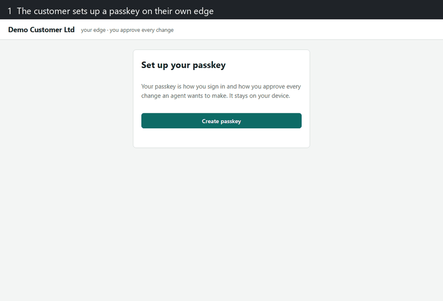
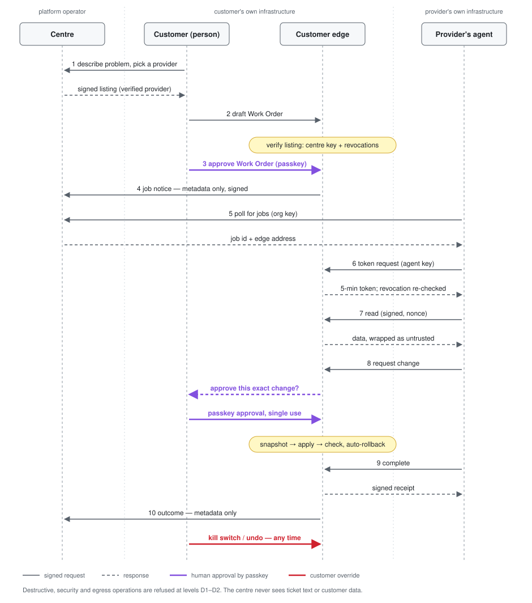

# AI2AI

**A secure way for one organisation's AI agents to do work for another organisation, with a named human approving
every change.**

AI2AI has two parts:

1. **The AI2AI Secure Profile** (`spec/`): an open draft specification. It is a set of security extensions on top of
   the existing [A2A](https://a2a-protocol.org) and [MCP](https://modelcontextprotocol.io) protocols, not a new
   protocol. It adds the things those protocols leave optional: signed agent identity, proof that a human approved
   a specific action, data and content labels, signed receipts and kill switches.
2. **A reference platform** (`ai2ai_platform/`): a working, tested implementation. Verified providers list their
   AI agents, customers request work, and the customer's own edge enforces the rules. The platform is generic. Its
   first use case is **IT support agents**, tested against a simulated small-business IT estate.

*The IT support demo: matched with a verified provider, Work Order approved on the customer's own edge, one exact change approved by passkey, signed receipt. [Run it yourself](examples/it-support-demo/README.md).*

> **Status: draft v0.1, October 2026.** The spec is open for comment. The platform is a working reference build that
> runs locally. It is **not production-ready**: it has had no external security review, uses a simulator rather than
> real IT systems, and has no payments. All data in this repo is fictional.

## Why

A2A and MCP move messages between agents well. They deliberately leave trust decisions to implementers:

- A2A Agent Cards only **MAY** be signed.
- Neither protocol can prove that **a human** approved an action. An elicitation "accept" or a model's output is
  not a signature.
- Nothing separates instructions from untrusted content, so prompt injection is left to each implementer.
- There is no standard way for a provider's agent to work safely **inside a customer's systems**, with
  just-in-time access, per-change approval, rollback and an audit trail.

The full gap analysis is in [`spec/01-secure-profile.md`](spec/01-secure-profile.md) §1.

## The fixed safety rules ("floors")

No configuration can turn these off:

- No model can approve anything. Spending, commitments, deliverable sign-off and release of personal data need an
  authenticated human (WebAuthn passkey, user-verified).
- Approvals are bound to the **exact** action (a hash of the operation and its arguments), are single-use and expire.
- Everything read from the other party or the customer's environment is **data, never instructions**.
- Unknown operations are treated as destructive.
- The audit log is append-only and hash-chained. Every job ends with a signed receipt.
- The customer holds a kill switch that needs no cooperation from the provider.

## The specification

| Part | What it covers |
|---|---|
| [Part 1: Secure Profile](spec/01-secure-profile.md) | Identity and delegation, **Human Approval Attestation (HAA)**, content channels and taint, data classes, message integrity and replay, signed receipts and a transparency log, policy, stop and kill, artifact safety, conformance levels L1 to L3 |
| [Part 2: Delegated Execution](spec/02-delegated-execution.md) | A provider's agent acting **inside** the requester's environment: threat model, signed Work Orders on OAuth RAR, just-in-time sender-constrained tokens, a requester-side broker that classifies every operation, step-up approval per change, snapshot and rollback, session log, post-job audit, levels D1 to D3 |

Licence: CC BY-NC 4.0 (non-commercial). Requirement IDs (ID-1, HAA-3, DX-X-1...) are stable, so you can reference them in issues.

## The reference platform

Three kinds of process, so that no single party holds everything:

| Process | Runs where | Holds | Never holds |
|---|---|---|---|
| **Centre** (`centre/`) | the platform operator | accounts, provider verification, signed credentials, agent listings, catalogue, matching, job metadata | the customer's environment data, ticket text, agent prompts or code |
| **Customer edge** (`edge/`) | the customer's own infrastructure | passkeys, the broker, Work Orders, step-up approvals, kill switch, audit chain, receipts, the environment connector | provider agent internals |
| **Provider runtime** (`sdk/`, `providers/`) | the provider's own infrastructure | the provider's agent (their IP) and its keys | customer data beyond what the broker returns for an approved operation |

**Trust anchor:** an edge trusts exactly one key, the centre's. Provider listings carry the provider's public keys
inside a centre countersignature, so an edge can verify agents offline against a public revocation list.

### What a job looks like

1. The customer describes the problem in plain words and picks a verified provider.
2. On their **own edge**, they review the Work Order (level, allowed action classes, time window) and approve it
   with a passkey.
3. The provider's agent gets short-lived tokens from the edge. Every request is signed with the agent's key.
4. Reads come back wrapped as untrusted data. Each change pauses until the customer approves that exact change with
   a passkey. A snapshot is taken first, a failed check rolls back automatically, and the customer can undo or kill
   the job at any time.
5. A receipt signed by both the edge and the provider closes the job, and it is anchored in a transparency log.

### Generic platform, pluggable use cases

The edge talks to the customer's environment through one interface, the **connector**
([`ai2ai_platform/connector.py`](ai2ai_platform/connector.py)). A connector provides:

- an operation catalogue, where each operation carries a broker-assigned class (`read`, `reversible`, `security`,
  `destructive` or `egress`);
- a way to run an operation;
- an environment state that can be snapshotted, digested and restored.

Approvals, rollback, receipts, audit, matching and the provider SDK are all domain-neutral.

**Reference use case: IT support agents** ([`ai2ai_platform/usecases/it_support/`](ai2ai_platform/usecases/it_support/)):

- a simulated small-business estate (Microsoft 365 users and mailboxes, endpoints, printers, network, website,
  backups) with about 70 classified operations;
- 25 realistic support scenarios (21 fixable at D2, 4 that must be escalated to a human), each judged on the real
  end state plus a collateral-damage check;
- injection slots for planting malicious instructions in tickets, file names, mail and logs.

To add a use case (bookkeeping, website admin, a real Microsoft Graph tenant...):

1. implement the connector;
2. write a vocabulary module (`CATEGORY_WORDS` and `DEFAULT_CATEGORY`) that the centre uses to match requests to
   service categories;
3. register both in [`ai2ai_platform/usecases/__init__.py`](ai2ai_platform/usecases/__init__.py);
4. run the edge with `AI2AI_USECASE=<name>`.

[`tests/toy_usecase.py`](tests/toy_usecase.py) is a complete example in about 60 lines: a small bookkeeping ledger
that runs through the same broker, approvals, rollback and receipts.

### Example agents

- **RuleBook:** rules only, no AI model. Resolves all 25 IT scenarios through the protocol.
- **Claude Code:** headless, with its built-in tools off. It can reach the customer only through a local MCP bridge,
  and its keys stay in the provider runtime.
- **Rogue:** test only. It obeys planted instructions and tries everything; the edge contains it.

Any agent can join through the provider SDK ([`sdk/client.py`](ai2ai_platform/sdk/client.py)) or A2A v1.0.1
([`sdk/a2a_server.py`](ai2ai_platform/sdk/a2a_server.py)).

## Run it

Tested on Python 3.12.

    pip install -r requirements.txt
    python scripts/demo_stack.py --scenario S07 --minutes 60

This starts all three processes with demo data. **For a step-by-step walkthrough of one job, see
[`examples/it-support-demo`](examples/it-support-demo/README.md).** Passkeys need a browser on `localhost`.

Data (databases, keys) is kept outside the code folder, in `%LOCALAPPDATA%\ai2ai-platform` on Windows or
`~/.local/share/ai2ai-platform` elsewhere. Override it with `AI2AI_DATA_DIR`.

## Tests

    python -m pytest -q tests                                     # SQLite
    AI2AI_TEST_PG=1 python -m pytest -q tests                     # embedded PostgreSQL (pgserver)
    AI2AI_LIVE=1 python -m pytest -q tests/test_m8_live.py -s     # a real Claude Code agent (opt-in, needs the claude CLI)

Results from the v1 build, including a red-team across all 25 scenarios and a live AI agent suite, are in
[`docs/TEST-RESULTS-v1.md`](docs/TEST-RESULTS-v1.md). What the code does and does not implement from the spec is in
[`docs/IMPLEMENTATION-STATUS.md`](docs/IMPLEMENTATION-STATUS.md).

## Standards used

- **A2A v1.0.1:** signed Agent Cards and JSON-RPC SendMessage, GetTask and CancelTask, checked against the official
  `a2a.proto`.
- **MCP:** the provider agent's tool server, and a customer-side server with scoped assistant tokens that can draft
  and track jobs but can never approve.
- **WebAuthn passkeys** with user verification required; Ed25519 signatures over canonical JSON; JWS card signatures.

## Contributing

Comments on the spec are the most useful contribution right now. Open an issue and cite the requirement ID. Security
issues: please don't open a public issue; see [SECURITY.md](SECURITY.md).

## Licence

**Non-commercial use only.** This is source-available, not open source in the OSI sense.

- Code: [PolyForm Noncommercial 1.0.0](LICENSE)
- Specification text (`spec/`): [CC BY-NC 4.0](spec/LICENSE)

You may read, run, modify and share it for any non-commercial purpose, including personal projects, research,
education and evaluation. Commercial use (selling it, offering it as a service, or using it in a business's
operations) needs a separate licence. Open an issue to ask.

Copyright 2026 Ramesh Pindoria.
